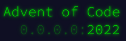

<!-- Projet Shields -->
[![Contributors][contributors-shield]][contributors-url]
[![Forks][forks-shield]][forks-url]
[![Stargazers][stars-shield]][stars-url]
[![Issues][issues-shield]][issues-url]
[![MIT License][license-shield]][license-url]
[![LinkedIn][linkedin-shield]][linkedin-url]

<!-- Replace these markers with infos - "Aoc2022"-->

<!-- PROJECT LOGO -->
 

  

<h3 align="center">Advent of Code - 2022</h3>
  

    <a href="https://github.com/Isnubi/Aoc2022/"><strong>Explore the docs »</strong></a>
     --------------------
     
    <a href="https://github.com/Isnubi/Aoc2022/issues">Report Bug</a>
    ·
    <a href="https://github.com/Isnubi/Aoc2022/issues">Request Feature</a>
  

<!-- TABLE OF CONTENTS -->

  
Table of Contents

  <ol>
    <li>
      <a href="#about-the-project">About The Project</a>
      <ul>
        <li><a href="#built-with">Built With</a></li>
      </ul>
    </li>
    <li><a href="#usage">Usage</a></li>
    <li><a href="#contributing">Contributing</a></li>
    <li><a href="#license">License</a></li>
    <li><a href="#contact">Contact</a></li>
  </ol>

<!-- ABOUT THE PROJECT -->
## About The Project

    

This is a repository for the Advent of Code 2022. The goal is to solve the puzzles in the minimum lines of code possible. The code is written in Python 3.10.5.

(<a href="#readme-top">back to top</a>)

### Built With

* [![Python][Python-shield]][Python-url]

(<a href="#readme-top">back to top</a>)

<!-- USAGE EXAMPLES -->
## Usage

If you want to use it, just take the code and the input file and launch the code.

(<a href="#readme-top">back to top</a>)

<!-- CONTRIBUTING -->
## Contributing

Contributions are what make the open source community such an amazing place to learn, inspire, and create. Any contributions you make are **greatly appreciated**.

If you have a suggestion that would make this better, please fork the repo and create a pull request. You can also simply open an issue with the tag "enhancement".
Don't forget to give the project a star! Thanks again!

1. Fork the Project
2. Create your Feature Branch (`git checkout -b feature/AmazingFeature`)
3. Commit your Changes (`git commit -m 'Add some AmazingFeature'`)
4. Push to the Branch (`git push origin feature/AmazingFeature`)
5. Open a Pull Request

(<a href="#readme-top">back to top</a>)

<!-- LICENSE -->
## License

Distributed under the MIT License. See `LICENSE.md` for more information.

(<a href="#readme-top">back to top</a>)

<!-- CONTACT -->
## Contact

Isnubi - [@Louis_Gambart](https://twitter.com/Louis_Gambart) - [contact@louis-gambart.fr](mailto:louis-gambart.fr)
 **Discord:** isnubi#6221

**Project Link:** [https://github.com/Isnubi/Aoc2022](https://github.com/Isnubi/Aoc2022)

(<a href="#readme-top">back to top</a>)

<!-- MARKDOWN LINKS & IMAGES -->
<!-- https://www.markdownguide.org/basic-syntax/#reference-style-links -->
[contributors-shield]: https://img.shields.io/github/contributors/Isnubi/Aoc2022.svg?style=for-the-badge
[contributors-url]: https://github.com/Isnubi/Aoc2022/graphs/contributors
[forks-shield]: https://img.shields.io/github/forks/Isnubi/Aoc2022.svg?style=for-the-badge
[forks-url]: https://github.com/Isnubi/Aoc2022/network/members
[stars-shield]: https://img.shields.io/github/stars/Isnubi/Aoc2022.svg?style=for-the-badge
[stars-url]: https://github.com/Isnubi/Aoc2022/stargazers
[issues-shield]: https://img.shields.io/github/issues/Isnubi/Aoc2022.svg?style=for-the-badge
[issues-url]: https://github.com/Isnubi/Aoc2022/issues
[license-shield]: https://img.shields.io/github/license/Isnubi/Aoc2022.svg?style=for-the-badge
[license-url]: https://github.com/Isnubi/Aoc2022/blob/master/LICENSE.md
[linkedin-shield]: https://img.shields.io/badge/-LinkedIn-black.svg?style=for-the-badge&logo=linkedin&colorB=555
[linkedin-url]: https://linkedin.com/in/louis-gambart
[Python-shield]: https://img.shields.io/badge/Python-3776AB?style=for-the-badge&logo=python&logoColor=white
[Python-url]: https://www.python.org/
[Twitter-shield]: https://img.shields.io/twitter/follow/Louis_Gambart?style=social
[Twitter-url]: https://twitter.com/Louis_Gambart/